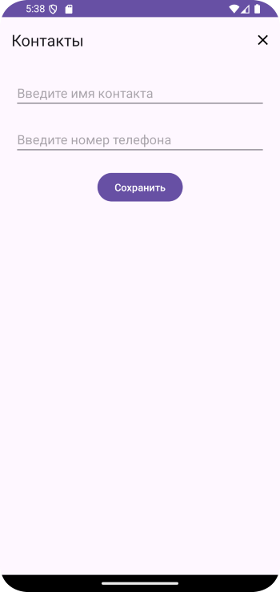

# Домашнее задание по теме "Room"

## Приложение «Контакты»

Необходимо написать приложение с использованием базы данных **Room**, в котором в поля ввода записываются контакты человека, например, его фамилия и номер телефона. По нажатию на кнопку **«Сохранить»** они записываются в базу данных и сразу выводятся в поле записной книжки **«Контакты»**. Следующий записанный контакт записывается ниже предыдущего. Приложение можно закрыть пунктом меню в **Toolbar**.

Для работы приложения необходимо создать:

1. **Toolbar**.
2. Поля ввода данных: фамилии и номера телефона.
3. Кнопка **«Сохранить»**.
4. Поле вывода информации.
5. Меню с пунктом **«Exit»**.

Логика работы приложения аналогична тематики отработанного занятия.

Приложение необходимо сохранить проектом в удаленном репозитории, для проверки качества предоставить ссылку преподавателю, либо сделать скрины эмулятора при каждом шаге работы приложения или снять видео экрана при работе приложения.

## Скриншоты к домашнему заданию по теме "Room"

Скриншоты

# Домашнее задание по теме "Room Practice Note"

## Приложение «Контакты»

Дорабатываем приложение с использованием базы данных **Room**, **ViewModel**, **RecyclerView** в котором в поля ввода записываются контакты человека, например, его фамилия и номер телефона. По нажатию на кнопку «Сохранить» они записываются в базу данных и сразу выводятся в список записной книжки **«Контакты»**. Кроме того, в списке у каждого элемента отображается время создания контакта. Контакты можно удалять либо по нажатия элемент списка, либо по нажатию на иконку удаления на элементе списка. Приложение можно закрыть пунктом меню в **Toolbar**.

Для работы приложения необходимо создать:

1. **Toolbar**.
2. Поля ввода данных: фамилии, инициалов (либо имени) и номера телефона.
3. Кнопка «Сохранить».
4. Список **RecyclerView**.
5. Файл элемента списка **list_item** с полями вывода фамилии, инициалов, номера телефона и времени создания контакта.
6. Меню с пунктом **«Exit»**.

Для работы необходимо создать класс репозитория **ContactRepository**, класс **ContactViewModel** и класс адаптера **ContactAdapter** для работы со списком **RecyclerView**.

Логика работы приложения аналогична тематики отработанного занятия.

Приложение необходимо сохранить проектом в удаленном репозитории, для проверки качества предоставить ссылку преподавателю, либо сделать скрины эмулятора при каждом шаге работы приложения или снять видео экрана при работе приложения.

## Скриншоты к домашнему заданию по теме "Room Practice Note"

Скриншоты

Use case diagram

